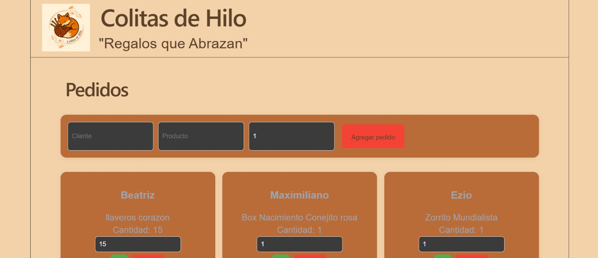

# 🧵 Colitas de Hilo

Aplicación desarrollada con **React** para gestionar los pedidos de un emprendimiento de accesorios textiles.

El proyecto permite registrar pedidos, editar cantidades, aumentar unidades y eliminar pedidos. Además, utiliza **localStorage** para conservar la información incluso después de cerrar o actualizar el navegador.

---

## 📸 Vista previa



---

## ✨ Funcionalidades

* 📦 Agregar nuevos pedidos.
* ✏️ Editar la cantidad de cada pedido.
* ➕ Aumentar la cantidad con un solo clic.
* 🗑️ Eliminar pedidos.
* 💾 Guardado automático mediante **localStorage**.
* 🎨 Interfaz personalizada con la identidad visual del emprendimiento.

---

## 🚀 Tecnologías utilizadas

* React
* JavaScript (ES6+)
* HTML5
* CSS3
* Vite

---

## 📁 Estructura del proyecto

```text
src/
│
├── assets/
│   └── logo.jpeg
│
├── components/
│   ├── Header/
│   │   ├── Header.jsx
│   │   └── Header.css
│   │
│   ├── PedidoCard.jsx
│   └── PedidoForm.jsx
│
├── App.jsx
├── App.css
├── ListaPedidos.jsx
├── index.css
└── main.jsx
```

---

## ⚙️ Instalación

1. Clonar el repositorio.

```bash
git clone URL_DEL_REPOSITORIO
```

2. Entrar en la carpeta del proyecto.

```bash
cd colitas-de-hilo
```

3. Instalar las dependencias.

```bash
npm install
```

4. Ejecutar el proyecto.

```bash
npm run dev
```

---

## 📚 Lo que aprendí

Durante el desarrollo de este proyecto puse en práctica conceptos fundamentales de React:

* Creación y reutilización de componentes.
* Manejo de estado con `useState`.
* Persistencia de datos utilizando `useEffect` y `localStorage`.
* Comunicación entre componentes mediante Props.
* Renderizado dinámico con `map()`.
* Actualización inmutable del estado.
* Organización del proyecto y separación de responsabilidades.
* Personalización de la interfaz mediante CSS.

---

## 🎯 Próximas mejoras

* Validación más completa de los formularios.
* Búsqueda y filtrado de pedidos.
* Ordenamiento por cliente o producto.
* Marcado de pedidos entregados.
* Responsive para dispositivos móviles.

---

## 👩‍💻 Autora

Desarrollado por **Yesica Farías** como parte de mi proceso de formación en desarrollo Frontend, aplicando buenas prácticas de organización, componentes reutilizables y manejo del estado con React.
